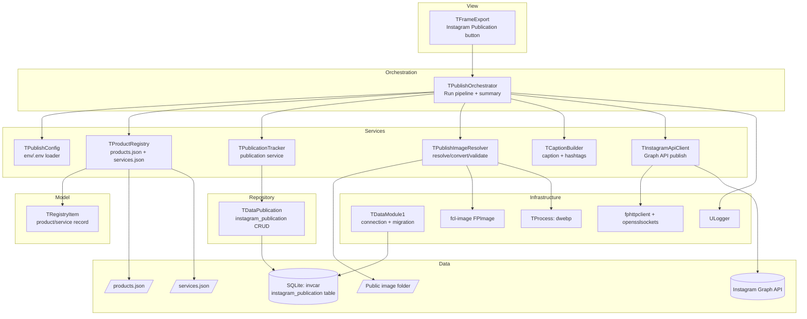
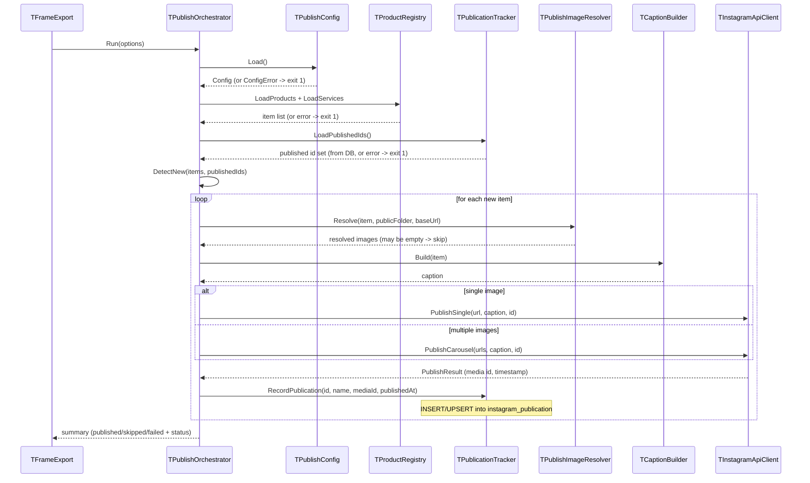

# Design Document: Instagram Auto-Publish (Free Pascal Port)

## Overview

This feature ports the Python `don-pilido-app/scripts` automation into the Apotheca POS codebase using Free Pascal / Lazarus (FPC), matching the project's existing conventions (service-layer units, repository/`TData` classes, `TDataModule1` schema migrations, `ULogger` structured logging, `TProcess` for external CLIs).

The migration cleanly separates two distinct pipelines that the Python project blurred together, each with a user-facing name:

- **Update Web Catalog** — the existing JSON Export feature (`TExportService` + `TJsonSerializer`) that writes `products.json` and `services.json` for the web store. This pipeline is unchanged by this spec; it is named here only to make the boundary explicit.
- **Instagram Publication** — the new pipeline this spec adds: read the catalog JSON, detect products not yet published, generate captions, resolve/validate images, publish to Instagram, and record each publication in the database.

The two pipelines are decoupled: *Update Web Catalog* produces the JSON files; *Instagram Publication* consumes them. They share no runtime state beyond those files and can be run independently.

Both pipelines are triggered from the **existing Export frame** (`TFrameExport`) in the running application: the current button drives *Update Web Catalog*, and a new "Instagram Publication" button drives this feature. No new application or standalone program is introduced — the feature is a set of reusable service units invoked from the Export frame using the application's already-open database connection.

The *Instagram Publication* pipeline runs as:

1. **Load config** from environment variables and an optional `.env` file.
2. **Load the registry** from `products.json` and `services.json` (defaulting to `don-pilido-app/src/res/`).
3. **Load publication records** from the SQLite database.
4. **Detect new items** (visible and not yet published).
5. For each new item: **resolve images**, **build a caption**, **publish** via the Instagram Graph API, and **record the publication** (media id + publish date) in the database after each success.
6. **Report a summary** back to the Export frame status label.

### Publication tracking moves to SQLite

The original Python tool tracked published products in a flat file (`scripts/instagram-published.json`). In this port, publication state lives in the main SQLite database in a new `instagram_publication` table. This keeps the published-catalog state authoritative and queryable alongside the rest of the POS data, survives file moves/deploys of the JSON, and lets future reporting join publications against products. The table records, per catalog item, the Instagram media id and the publish date/time, so the catalog stays continuously up to date across runs.

### Design Rationale

- **In-app, no new program**: The feature is invoked from the existing `TFrameExport` via a new "Instagram Publication" button, right next to the existing "Update Web Catalog" (export) button. The pipeline logic lives in reusable service units so the frame simply constructs `TPublishOrchestrator` with `DataModule1.SQLite3Connection1` and shows the summary in the frame's status label. This keeps everything inside the one Apotheca POS application, matching how the Export feature already works.
- **SQLite for tracking (not a JSON file)**: Publication history is domain state, so it belongs in the database next to products, following the same repository (`TData` subclass) and `TDataModule1` migration pattern already used for the `images` table and the product export columns. A dedicated repository (`TDataPublication`) isolates the SQL.
- **`fpjson` + `jsonparser` for reading the catalog**: The registry files are external, third-party JSON with optional fields and mixed types; FPC's DOM parser (`TJSONData`/`GetJSON`) handles this robustly.
- **`fphttpclient` + `opensslsockets` for HTTPS**: This is FPC's standard synchronous HTTP client and supports the query/multipart POSTs the Graph API needs, replacing Python's `requests`. `opensslsockets` enables TLS.
- **`fcl-image` (FPImage) for image work**: Aspect-ratio inspection and JPEG writing use `TFPMemoryImage` + `TFPReaderPNG`/`TFPReaderJPEG` + `TFPWriterJPEG`. For WebP sources (no stable native FPC reader), we invoke the `dwebp` CLI via `TProcess` to decode to PNG first, consistent with how the Export feature already shells out to `cwebp`.
- **Reuse `ULogger`**: All logging goes through the existing structured logger (`LogInfo`/`LogWarn`/`LogError` with `Source`/`Event`/`Details`), so publication runs land in `apotheca.log` alongside the rest of the app. The logger is already initialized by the application at startup.

## Architecture



### Pipeline Sequence



## Components and Interfaces

All new units live under `service/`, the model record under `model/`, and the repository under `repository/`, following the existing layout. The only view change is wiring a button in the existing `view/uframeexport.pas`. Naming follows the `U`-prefix convention.

### TRegistryItem (Model)

**Unit**: `model/uregistryitem.pas`

```pascal
TRegistryKind = (rkProduct, rkService);

TRegistryItem = class(TObject)
private
  FId: String;
  FName: String;
  FCategory: String;
  FPrice: Integer;
  FHasOriginalPrice: Boolean;
  FOriginalPrice: Integer;
  FDescription: String;
  FImages: TStringList;   // owned
  FIsVisible: Boolean;
  FBrand: String;
  FKind: TRegistryKind;
public
  constructor Create;
  destructor Destroy; override;
  // property accessors for all fields
end;
```

`FImages` is always allocated; services with a single `image` string map to a one-element list, absent/empty to an empty list. `FHasOriginalPrice` distinguishes "no discount baseline" from a zero original price.

### TPublishConfig (Service)

**Unit**: `service/upublishconfig.pas`

```pascal
EPublishConfigError = class(Exception);

TPublishConfig = class(TObject)
private
  FAccessToken: String;
  FBusinessAccountId: String;
  FImageBaseUrl: String;
public
  class function Load(const EnvFilePath: String): TPublishConfig;  // raises EPublishConfigError
  property AccessToken: String read FAccessToken;
  property BusinessAccountId: String read FBusinessAccountId;
  property ImageBaseUrl: String read FImageBaseUrl;
end;
```

- Reads `INSTAGRAM_ACCESS_TOKEN`, `INSTAGRAM_BUSINESS_ACCOUNT_ID`, `PUBLIC_IMAGE_BASE_URL` via `GetEnvironmentVariable`.
- A minimal `.env` parser reads `KEY=VALUE` lines (ignoring blanks and `#` comments), and only sets a value when the corresponding environment variable is empty (system env wins).
- Raises `EPublishConfigError` listing all missing variables, or a scheme error when the base URL is not `http(s)://`.

### TProductRegistry (Service)

**Unit**: `service/uproductregistry.pas`

```pascal
ERegistryError = class(Exception);

TProductRegistry = class(TObject)
public
  // Returns owned TObjectList of TRegistryItem; caller frees.
  class function LoadProducts(const Path: String): TFPObjectList;  // raises ERegistryError
  class function LoadServices(const Path: String): TFPObjectList;  // raises ERegistryError
end;
```

- Uses `GetJSON` to parse; requires the root to be a `TJSONArray`.
- Products: maps `id, name, category, price, originalPrice?, description, images?[], isVisible?, brand?`; `rkProduct`.
- Services: maps `id, name, price, originalPrice?, description, image?`; `category`/`brand` empty, `isVisible := true`, `rkService`; a non-empty `image` becomes the single element of `FImages`.
- Missing `id`/`name`/`price`/`description` raises `ERegistryError` naming the entry.
- A **missing file** raises `ERegistryError`; the orchestrator decides per Requirement 2.6 whether an absent file is tolerated (empty list) based on which exports are requested.

### instagram_publication table + TDataPublication (Repository)

**Migration unit**: `infrastructure/udatamodule.pas` (extended)
**Repository unit**: `repository/udatapublication.pas`

Publication state lives in a new table in the main SQLite database, created via a `TDataModule1.CreatePublicationTable` method wired into `DataModuleCreate` alongside the existing `CreateImagesTable`:

```sql
CREATE TABLE IF NOT EXISTS instagram_publication (
  id INTEGER PRIMARY KEY AUTOINCREMENT,
  product_id INTEGER NOT NULL UNIQUE, -- FK to product.id
  item_name TEXT NOT NULL,
  media_id TEXT NOT NULL,             -- Instagram media id returned on publish
  published_at TEXT NOT NULL,         -- ISO 8601 UTC, e.g. 2026-09-01T12:00:00Z
  FOREIGN KEY(product_id) REFERENCES product(id)
);
CREATE INDEX IF NOT EXISTS idx_pub_product ON instagram_publication(product_id);
```

The table foreign-keys into `product.id` so publication history joins directly against the POS product table. The catalog JSON, however, identifies items by a **string** id (`p42` for products, `s3` for services) that the JSON Export feature builds as the letter `p`/`s` prefixed to the integer `product.id` (see `TJsonSerializer.SerializeProduct`/`SerializeService`). The publisher therefore derives the integer `product_id` from a catalog id by stripping the single leading `p` or `s` prefix and parsing the remainder as an integer. Catalog ids whose remainder is not a plain integer (e.g. the don-pilido demo ids `p7c`, `s3`) cannot map to a `product.id`; the publisher logs a warning and skips those items rather than fabricating a key. `published_at` is stored as ISO 8601 UTC text for portability and easy ordering.

The repository follows the existing `TData` pattern (see `repository/udataimage.pas`):

```pascal
TPublicationRecord = record
  ProductId: Integer;   // FK to product.id
  ItemName: String;
  MediaId: String;
  PublishedAt: String;  // ISO 8601 UTC
end;

TDataPublication = class(TData)
public
  constructor Create(Connection: TSQLite3Connection);
  function IsPublished(ProductId: Integer): Boolean;
  function LoadPublishedIds(): TStringList;                 // product ids as decimal strings; caller frees
  function Record_(const Rec: TPublicationRecord): Boolean; // INSERT ... ON CONFLICT(product_id) DO UPDATE
  function Get(ProductId: Integer): TPublicationRecord;
  { Maps a catalog id ("p42"/"s3") to product.id; returns False when the id has
    no p/s prefix or a non-integer remainder. }
  class function TryParseCatalogId(const CatalogId: String; out ProductId: Integer): Boolean;
end;
```

`Record_` upserts on `product_id` (SQLite `INSERT ... ON CONFLICT(product_id) DO UPDATE SET media_id=..., published_at=..., item_name=...`), so re-publishing an item refreshes its media id and date, keeping the catalog's publication state current.

### TPublicationTracker (Service)

**Unit**: `service/upublicationtracker.pas`

```pascal
ETrackingError = class(Exception);

TPublicationTracker = class(TObject)
private
  FData: TDataPublication;
public
  constructor Create(AConnection: TSQLite3Connection);
  destructor Destroy; override;
  { Set of published product ids as decimal strings; caller frees; raises ETrackingError on DB error. }
  function LoadPublishedIds(): TStringList;
  { True when the catalog item is already published. CatalogId is "p42"/"s3";
    an unmappable id is treated as not-published so detection can skip it later. }
  function IsPublished(const CatalogId: String): Boolean;
  { Persists a publication immediately after a successful publish. CatalogId is
    mapped to product.id; raises ETrackingError on unmappable id or DB write failure
    (orchestrator treats this as critical). }
  procedure RecordPublication(const CatalogId, ItemName, MediaId, PublishedAt: String);
end;
```

The tracker wraps `TDataPublication`, translating DB failures into `ETrackingError` so the orchestrator can apply the "stop on tracking failure" rule (Requirement 3.5). It records each publication in its own committed write right after the corresponding Graph API success, so an interrupted run never loses or duplicates publication state.

### TCaptionBuilder (Service)

**Unit**: `service/ucaptionbuilder.pas`

```pascal
TCaptionBuilder = class(TObject)
public
  class function Build(Item: TRegistryItem): String;
  class function FormatPriceCop(Amount: Integer): String;              // 25000 -> "$25.000 COP"
  class function DiscountPercent(Price, OriginalPrice: Integer): Integer; // round-half
end;
```

- Category hashtag sets and general hashtags are constant arrays mirroring the Python module.
- Body: `🎱 name`, optional `Marca: brand` (only when brand not empty and not `Don Pulido`), blank line, description, blank line, `💰 price`, optional discount line `~orig~ ¡Ahorra N%!`, blank line, `🛒 Disponible en donpulido.com`.
- Hashtags: `#DonPulido` + up to 5 category tags + general tags, capped at 16.
- Length control (max 2200 UTF-8-safe using `UTF8Length`): drop trailing hashtags first; if still too long with one hashtag, binary-search the longest description prefix (with `...`) that fits.

### TPublishImageResolver (Service)

**Unit**: `service/upublishimageresolver.pas`

```pascal
TResolvedImage = record
  PublicUrl: String;
  LocalPath: String;
end;
TResolvedImageArray = array of TResolvedImage;

TPublishImageResolver = class(TObject)
private
  function CheckAspectRatio(const Path: String): Boolean;
  function ConvertToJpeg(const SourcePath, OutputPath: String): Boolean; // crop to range if needed
  function DecodeWebpToPng(const WebpPath, PngOut: String): Boolean;      // TProcess dwebp
public
  function Resolve(Item: TRegistryItem; const PublicFolder, BaseUrl: String): TResolvedImageArray;
end;
```

- Aspect-ratio range constants: `MIN = 4/5 = 0.8`, `MAX = 1.91`.
- `Resolve` iterates `Item.Images`, strips a leading `/`, and for each filename:
  - If the exact file exists: valid ratio -> original URL; invalid ratio -> JPEG crop -> JPEG URL.
  - Else if a `.webp` sibling exists: decode via `dwebp` to a temp PNG, then JPEG-crop -> JPEG URL.
  - Else log a warning and skip.
- URLs are `BaseUrl` (trailing slash trimmed) + `/` + filename.
- Result capped at 10 (`MAX_CAROUSEL_IMAGES`).
- Cropping: ratio `< MIN` crops height to `width / MIN` centered; ratio `> MAX` crops width to `height * MAX` centered. JPEG quality 90.

### TInstagramApiClient (Service)

**Unit**: `service/uinstagramapiclient.pas`

```pascal
EAuthError = class(Exception);
EPublishError = class(Exception);

TPublishResult = record
  MediaId: String;
  ProductId: String;
  Timestamp: String; // YYYY-MM-DDTHH:MM:SSZ (UTC)
end;

TInstagramApiClient = class(TObject)
private
  FConfig: TPublishConfig;
  function MakeRequest(const Method, Url: String; Params: TStrings): TJSONObject; // retries + error mapping
  procedure WaitForContainerReady(const ContainerId: String);
  function PublishContainer(const ContainerId: String): String;
public
  constructor Create(AConfig: TPublishConfig);
  function PublishSingleImage(const ImageUrl, Caption, ProductId: String): TPublishResult;
  function PublishCarousel(const ImageUrls: array of String; const Caption, ProductId: String): TPublishResult;
end;
```

- Base URL `https://graph.instagram.com/v21.0`; `access_token` appended to every request.
- `MakeRequest` maps HTTP 401 or error code 190 to `EAuthError`; HTTP 429 or code 4 to a bounded retry (max 3) with exponential backoff (honoring `Retry-After` when present); other API/HTTP errors to `EPublishError`.
- `WaitForContainerReady` polls `GET /{container}?fields=status_code` every 5s up to 60s; `FINISHED`/`PUBLISHED` succeed, `ERROR`/`EXPIRED`/timeout raise `EPublishError`.
- Timestamps are formatted from `NowUTC` as `YYYY-MM-DDTHH:MM:SSZ`.

### TPublishOrchestrator (Service)

**Unit**: `service/upublishorchestrator.pas`

```pascal
TPublishOptions = record
  EnvFilePath: String;
  ProductsPath: String;   // default don-pilido-app/src/res/products.json
  ServicesPath: String;   // default don-pilido-app/src/res/services.json
  PublicFolder: String;
  IncludeProducts: Boolean;
  IncludeServices: Boolean;
end;

TPublishSummary = record
  Published: Integer;
  Skipped: Integer;
  Failed: Integer;
  ExitCode: Integer;   // 0 = completed, 1 = stopped by a critical error
end;

TPublishOrchestrator = class(TObject)
public
  constructor Create(AConnection: TSQLite3Connection);
  function Run(const Options: TPublishOptions): TPublishSummary;
end;
```

The orchestrator receives the shared `TSQLite3Connection` (from `DataModule1`) at construction and uses it to build the `TPublicationTracker`; publication tracking is therefore a database concern, not a file path. It implements the sequence above. Critical errors (`EPublishConfigError`, `ERegistryError`, `ETrackingError`, `EAuthError`, publication-record write failure) set `ExitCode := 1` (a status flag, not an OS process exit code) and stop; per-item `EPublishError` increments `Failed` and continues.

### TFrameExport (View integration)

**Unit**: `view/uframeexport.pas` (existing) + `view/uframeexport.lfm`

No new program is added. The existing Export frame gains a second button, `btnPublishInstagram` ("Instagram Publication"), placed next to the existing `btnExport` ("Update Web Catalog"). Its `OnClick` handler:

- Builds `TPublishOptions` with defaults: products at `../don-pilido-app/src/res/products.json` (relative to the app dir), services alongside, public folder `../don-pilido-app/public`, `.env` at `export/.env`, and `IncludeProducts`/`IncludeServices` taken from the frame's existing checkboxes.
- Calls `DataModule1.EnsureTransaction`, constructs `TPublishOrchestrator` with `DataModule1.SQLite3Connection1`, runs it, and writes the resulting `Published/Skipped/Failed` counts to the frame's `lblStatus` label (the same label used by the export action).

The `instagram_publication` table is created at application startup by `TDataModule1.CreatePublicationTable`, so the handler does not manage schema. Logging goes to `apotheca.log` via the app's already-initialized `ULogger`.

## Data Models

### Products file entry (input)
```json
{ "id": "p1", "name": "...", "category": "Kits", "price": 25000,
  "originalPrice": 80000, "description": "...", "images": ["/x.webp"],
  "isVisible": true, "brand": "Don Pulido" }
```

### Services file entry (input)
```json
{ "id": "s1", "name": "...", "price": 10000, "originalPrice": 25000,
  "description": "...", "image": "/y.png" }
```

### Publication state (SQLite `instagram_publication` table)
One row per published product, keyed by `product.id`, kept current across runs:

| column | type | notes |
|--------|------|-------|
| id | INTEGER PK AUTOINCREMENT | surrogate key |
| product_id | INTEGER UNIQUE, FK -> product.id | derived from the catalog id (`p42` -> 42) |
| item_name | TEXT | item name at publish time |
| media_id | TEXT | Instagram media id returned on publish |
| published_at | TEXT | ISO 8601 UTC, e.g. `2026-09-01T12:00:00Z` |

Example row: `(1, 1, 'Kit ...', '17891234567890', '2026-09-01T12:00:00Z')` for catalog id `p1`.

## Correctness Properties

### Property 1: New-Item Detection
*For any* registry list and tracking set, an item is returned by detection *iff* `isVisible = true` AND its id is not in the tracking set. Order within each source file is preserved.
**Validates: Requirements 4.1, 4.2**

### Property 2: Price Formatting
*For any* non-negative integer `A`, `FormatPriceCop(A)` produces `"$" + <A with '.' thousands separators> + " COP"` (e.g. `1000 -> "$1.000 COP"`, `250 -> "$250 COP"`).
**Validates: Requirements 5.2**

### Property 3: Discount Percentage
*For any* integers `0 < price < original`, `DiscountPercent = round((original - price) / original * 100)` with half-up rounding.
**Validates: Requirements 5.3**

### Property 4: Caption Length Bound
*For any* registry item, `Build(item)` returns a string whose UTF-8 length is at most 2200, and hashtags are removed before the description is truncated.
**Validates: Requirements 5.4, 5.5**

### Property 5: Public URL Construction
*For any* base URL `B` and filename `F` (no leading slash), the resolved public URL equals `TrimRightSlash(B) + '/' + F`, containing no `//` between host and path beyond the scheme.
**Validates: Requirements 6.2**

### Property 6: Aspect-Ratio Acceptance
*For any* image with width `w > 0` and height `h > 0`, `CheckAspectRatio` returns true *iff* `0.8 <= w/h <= 1.91`.
**Validates: Requirements 6.3, 6.4**

### Property 7: Carousel Cap
*For any* item, `Resolve` returns at most 10 resolved images.
**Validates: Requirements 6.7**

### Property 8: Publication Record Round-Trip
*For any* publication record written via `TDataPublication.Record_`, reading it back with `Get` yields equal `product_id`, `item_name`, `media_id`, and `published_at`; `IsPublished(product_id)` returns true; and `LoadPublishedIds` contains that product id exactly once even after the same product is recorded twice (upsert on `product_id`).

### Property 8b: Catalog Id Mapping
*For any* catalog id of the form `<p|s><integer>`, `TryParseCatalogId` returns true with `ProductId` equal to that integer; *for any* id lacking a `p`/`s` prefix or with a non-integer remainder, it returns false.
**Validates: Requirements 3.2, 3.4**

## Error Handling

| Error | Detection | Response | Exit |
|-------|-----------|----------|------|
| Missing/empty env var | TPublishConfig.Load | Raise EPublishConfigError naming vars | 1 |
| Bad base URL scheme | TPublishConfig.Load | Raise EPublishConfigError | 1 |
| Missing/malformed registry file | TProductRegistry | Raise ERegistryError naming file | 1 |
| Missing required field in entry | TProductRegistry | Raise ERegistryError naming entry | 1 |
| Publication table read failure | TPublicationTracker.LoadPublishedIds | Raise ETrackingError | 1 |
| Publication write failure after publish | TPublicationTracker.RecordPublication | Log error, count published, stop | 1 |
| Publication table creation failure | TDataModule1.CreatePublicationTable | Log error; publishing disabled for the run | 1 |
| No images for item | TPublishImageResolver.Resolve | Log, skip item, count skipped | continue |
| Image file/WebP not found | TPublishImageResolver.Resolve | Log warning, skip that image | continue |
| dwebp missing / decode fail | TPublishImageResolver | Log warning, skip that image | continue |
| Auth error (401 / code 190) | TInstagramApiClient | Raise EAuthError, log partial summary | 1 |
| Rate limit (429 / code 4) | TInstagramApiClient | Retry w/ backoff up to 3, else EPublishError | continue |
| Container ERROR/EXPIRED/timeout | WaitForContainerReady | Raise EPublishError for item | continue |
| Other publish failure | Orchestrator | Log, count failed, continue | continue |

## Testing Strategy

Follows the existing FPCUnit pattern (`tests/test_*.pas` compiled by `tests/run_*.lpr`), with property-style checks using a small random harness (>=150 iterations) where a property is defined.

- `tests/test_caption_publish.pas` — Properties 2, 3, 4 (price format, discount, length bound) — pure, no I/O.
- `tests/test_detector_publish.pas` — Property 1 (new-item detection) — pure.
- `tests/test_publish_image_url.pas` — Properties 5, 6, 7 (URL construction, aspect ratio, cap) — ratio/URL logic isolated from disk where possible; on-disk cases use small generated PNGs in a temp dir.
- `tests/test_publish_tracking.pas` — Property 8 (publication record round-trip) — runs against a temporary in-file SQLite database created with the `instagram_publication` schema, then exercises `TDataPublication` insert/upsert/read.

The Graph API client is validated with example-based unit tests around `MakeRequest` error mapping (auth vs rate-limit vs generic) using a stubbable request seam; live API calls are out of scope for automated tests.

### Dependencies / Environment

- FPC packages: `fcl-json` (fpjson, jsonparser), `fcl-web`/`fphttpclient` + `opensslsockets`, `fcl-image` (FPImage readers/writers), `fcl-process` (`TProcess`), `sqlite3conn`/`sqldb` (already used by the app for the `instagram_publication` table).
- External CLI: `dwebp` (from libwebp) for decoding WebP inputs; absence is handled gracefully (those images are skipped with a warning), mirroring the Export feature's `cwebp` handling.
- Runtime config: `INSTAGRAM_ACCESS_TOKEN`, `INSTAGRAM_BUSINESS_ACCOUNT_ID`, `PUBLIC_IMAGE_BASE_URL` via environment or `export/.env`.

## Relationship to the "Update Web Catalog" pipeline

The two pipelines are named and separated as follows so they can be triggered and reasoned about independently:

| | Update Web Catalog | Instagram Publication |
|---|---|---|
| Purpose | Produce the web store's JSON catalog | Post new catalog items to Instagram |
| Entry point | `TExportService.Execute` / "Update Web Catalog" button | `TPublishOrchestrator.Run` / "Instagram Publication" button |
| Reads | POS database (products, services, images) | `products.json`, `services.json` |
| Writes | `products.json`, `services.json`, `.webp` images | Instagram media + `instagram_publication` table |
| Spec | `.kiro/specs/json-export` | this spec |

The Instagram Publication action never regenerates the catalog and `TExportService` never contacts Instagram; the JSON files are the only handoff between them. Both live behind the one Export frame.
