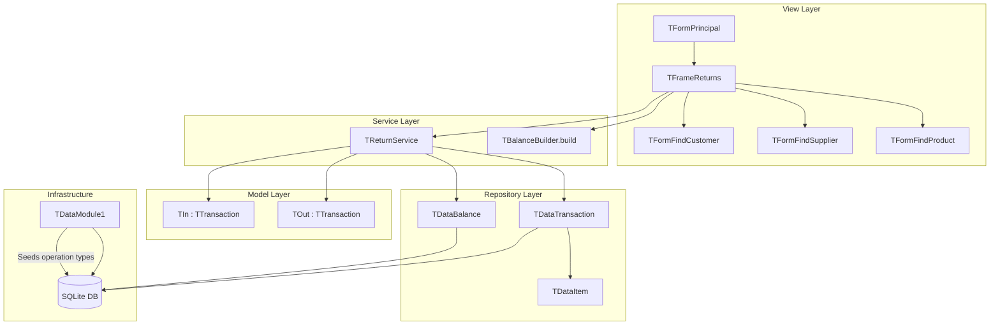

# Design Document: Inventory Returns/Losses

## Overview

This feature adds a new Returns/Losses management frame to the Apotheca POS application, enabling users to record three categories of inventory adjustments that fall outside regular purchases and sales:

- **Customer Devolution** (type "in"): product returned by a customer, increasing inventory
- **Inventory Loss** (type "out"): product written off, decreasing inventory
- **Return to Provider** (type "out"): product sent back to supplier, decreasing inventory

The feature integrates into the existing layered architecture (model → repository → service → view) and reuses established patterns: `TTransaction` model hierarchy, `TDataTransaction` repository, service-layer validation, and TStringGrid-based frames with sidebar navigation.

Additionally, the "Rebuild Balances" button exposes the existing `TBalanceBuilder.build()` method, which iteratively recalculates all product balances from transaction history.

## Architecture



### Design Decisions

1. **Reuse TIn/TOut for balance logic**: Rather than creating a new model class, `TReturnService` constructs either a `TIn` or `TOut` instance depending on the selected operation type. This reuses the proven `calculateNewBalance()` logic without duplication.

2. **Single TReturnService**: All three operation types (devolution, loss, provider return) are handled by one service since they share validation/persistence logic and only differ in direction ("in" vs "out") and person requirements.

3. **SQL-based RebuildAllBalances**: The existing `TBalanceBuilder.build()` iterates product-by-product with multiple queries. The new approach uses a single SQL query with window functions (or iterative cursor) within one transaction for better performance and atomicity.

4. **Operation type seeding in DataModule**: New types are seeded during `DataModuleCreate` alongside existing schema initialization, maintaining the existing startup pattern.

## Components and Interfaces

### TFrameReturns (View)

```pascal
TFrameReturns = class(TFrame)
  // UI Controls
  ComboOpType: TComboBox;          // Operation type selector
  BtnSelectPerson: TBitBtn;        // Find Customer/Supplier button
  EditPerson: TEdit;               // Read-only person name display
  DateEdit: TDateEdit;             // Operation date picker
  GridItems: TStringGrid;          // Items grid (Product, Qty, Unit Cost)
  BtnAddItem: TBitBtn;             // Add item row
  BtnDeleteItem: TBitBtn;          // Delete selected row
  BtnSave: TBitBtn;                // Save operation
  BtnRebuild: TBitBtn;             // Rebuild all balances
  StatusBarReturns: TStatusBar;    // Status messages

  // Internal state
  FReturnService: TReturnService;
  FOperationType: TOperationType;  // Currently selected op type
  FPerson: TPerson;                // Selected customer/supplier (or nil)
  FItems: TList;                   // TList of TItem
  FOperationDirection: String;     // 'in' or 'out'
end;
```

**Behavior:**
- `ComboOpType.OnChange`: Updates `FOperationDirection`, clears `FPerson`, enables/disables person selection
- `BtnSelectPerson.OnClick`: Opens `TFormFindCustomer` or `TFormFindSupplier` based on current type
- `BtnAddItem.OnClick`: Appends new TItem to FItems with qty=1, cost=0.00
- `BtnDeleteItem.OnClick`: Removes selected grid row if one is selected
- `BtnSave.OnClick`: Delegates to `TReturnService.SaveReturn()`
- `BtnRebuild.OnClick`: Calls `TReturnService.RebuildAllBalances()`, displays result

### TReturnService (Service)

```pascal
TReturnService = class(TObject)
private
  FLastError: String;
  function ValidateItems(items: TList): Boolean;
  function ValidatePerson(opType: TOperationType; person: TPerson): Boolean;
  function ValidateStock(items: TList): Boolean;
  function AggregateQuantitiesByProduct(items: TList): TList; // returns list of product/qty pairs
public
  function SaveReturn(opType: TOperationType; person: TPerson;
    date: TDateTime; items: TList): Boolean;
  function GetLastError: String;
end;
```

**SaveReturn flow:**
1. Validate items (at least one complete row with product and qty >= 1)
2. Validate person (required for Customer Devolution and Return to Provider)
3. If direction is "out": validate stock availability per product (aggregate quantities)
4. Construct TIn or TOut transaction with operation type, date, person, items
5. Call `calculateNewBalance()` on the transaction object
6. Begin DB transaction → persist via `TDataTransaction.new()` → commit or rollback

**Rebuild Balances (via existing TBalanceBuilder):**
- The `BtnRebuild.OnClick` handler creates a `TBalanceBuilder` instance and calls its `build()` method
- `TBalanceBuilder.build()` already iterates all products, replays all transactions (IN/OUT) chronologically, and updates balances via `TDataBalance.edit()`
- On success (returns `true`): display success message in status bar
- On failure (returns `false`): show `TBalanceBuilder.getBalanceMessage()` which lists products with negative stock

### DataModule Seeding (Infrastructure)

A new `SeedReturnOperationTypes` procedure added to `TDataModule1`:

```pascal
procedure TDataModule1.SeedReturnOperationTypes;
// Inserts operation types if not already present:
//   "Customer Devolution" (type "in")
//   "Inventory Loss" (type "out")
//   "Return to Provider" (type "out")
// Uses INSERT OR IGNORE pattern with description uniqueness check
```

Called from `DataModuleCreate` after existing schema initialization and migrations.

### Navigation Integration (View - TFormPrincipal)

- Add `stReturns` to `TSectionType` enum
- Add `BtnReturns: TBitBtn` to sidebar panel
- Add `FFrameReturns: TFrameReturns` field
- Wire up `BtnReturnsClick` → `NavigateTo(stReturns)`
- Add icon loading and caption assignment from resourcestrings

## Data Models

### Database Tables (No Schema Changes)

The feature uses existing tables without modification:

| Table | Usage |
|-------|-------|
| `operationtype` | New seed records (id auto, description, type) |
| `operation` | New rows for return operations (type FK → operationtype, date, person FK) |
| `item` | New rows per product in the return (product FK, operation FK, cost, stock, price) |
| `balance` | Updated stock/balance/cost/price per affected product |

### New Operation Type Records

| Description | Type | Direction |
|---|---|---|
| Customer Devolution | in | Adds to inventory |
| Inventory Loss | out | Removes from inventory |
| Return to Provider | out | Removes from inventory |

### In-Memory Models

No new model classes required. The feature reuses:
- `TOperationType` — selected from seeded records
- `TTransaction` / `TIn` / `TOut` — constructed at save time
- `TItem` — managed in frame's item list
- `TPerson` / `TCustomer` / `TSupplier` — from find dialogs
- `TBalance` — updated via `calculateNewBalance()`

## Correctness Properties

*A property is a characteristic or behavior that should hold true across all valid executions of a system — essentially, a formal statement about what the system should do. Properties serve as the bridge between human-readable specifications and machine-verifiable correctness guarantees.*

### Property 1: IN balance calculation preserves weighted average cost

*For any* product with a non-negative existing balance (stock ≥ 0, balance_value ≥ 0) and *for any* return item with cost > 0 and quantity ≥ 1, after applying the IN balance calculation: the new stock SHALL equal previous_stock + item_quantity, the new balance value SHALL equal previous_balance_value + (item_cost × item_quantity), and the new average cost SHALL equal new_balance_value / new_stock.

**Validates: Requirements 6.6**

### Property 2: OUT balance calculation uses current average cost

*For any* product with stock > 0 and balance_value > 0 and *for any* item with quantity ≤ current_stock, after applying the OUT balance calculation: the new stock SHALL equal previous_stock - item_quantity, and the new balance value SHALL equal previous_balance_value - (previous_average_cost × item_quantity).

**Validates: Requirements 6.7**

### Property 3: Stock validation correctly aggregates and rejects

*For any* set of items where multiple items reference the same product, the stock validation SHALL sum quantities per distinct product and reject the operation if and only if the computed sum for any product exceeds that product's current balance stock.

**Validates: Requirements 8.1, 8.2**

### Property 4: TBalanceBuilder rebuild skips negative-stock products

*For any* product whose operation history results in a negative computed stock, the `TBalanceBuilder.build()` method SHALL leave that product's balance record unchanged and include the product name and negative stock value in the balance message output.

**Validates: Requirements 9.4**

### Property 5: Item list validation accepts iff at least one complete row exists

*For any* list of items (including empty lists, lists with nil products, lists with qty = 0), the validation SHALL pass if and only if at least one item has a non-nil product and a quantity ≥ 1.

**Validates: Requirements 6.1**

### Property 6: Operation type seeding is idempotent

*For any* number of invocations of the seeding procedure, the operationtype table SHALL contain exactly one record for each of "Customer Devolution", "Inventory Loss", and "Return to Provider", with no duplicates and no modification to pre-existing records.

**Validates: Requirements 7.1, 7.2, 7.3, 7.4**

## Error Handling

| Scenario | Handling | User Feedback |
|----------|----------|---------------|
| No items with product selected | Validation rejects save | Status bar: "You must add at least one item with a product" |
| Customer Devolution without customer | Validation rejects save | Status bar: "You must select a customer" |
| Return to Provider without supplier | Validation rejects save | Status bar: "You must select a supplier" |
| OUT operation exceeds stock | Validation rejects save | Status bar: "Insufficient stock for: [Product] (available: N)" |
| Multiple products with insufficient stock | All reported | Status bar lists all affected products |
| Database transaction failure on save | Rollback all changes | Status bar: "Operation was not saved" |
| Database transaction failure on rebuild | TBalanceBuilder handles internally | Message dialog: shows balanceMessage from TBalanceBuilder |
| Rebuild finds negative-stock products | Skip those products | Message dialog: lists product names with negative stock from getBalanceMessage() |
| Future date selected | Auto-correct to today | Date picker reverts silently |

All error messages are defined as resourcestrings with RS_RETURNS_ prefix for i18n support.

## Testing Strategy

### Property-Based Tests (fpcunit + manual randomization)

The project uses Free Pascal's `fpcunit` framework with manual random input generation (same pattern as `test_balance_invariant.pas`). Each property test runs **100 iterations** with randomized inputs.

**Library**: fpcunit (already in use)
**Pattern**: Manual `Random()` / `RandomRange()` calls within test loops (no external PBT library — matches existing project convention)
**Minimum iterations**: 100 per property

Each test file is tagged with a comment referencing its design property:
```pascal
{ Feature: inventory-returns, Property N: [property text] }
```

**Property tests to implement:**
1. `test_return_balance_in.pas` — Property 1: IN calculation correctness
2. `test_return_balance_out.pas` — Property 2: OUT calculation correctness
3. `test_return_stock_validation.pas` — Property 3: Stock aggregation and rejection
4. `test_rebuild_negative_skip.pas` — Property 4: Negative stock skipping
5. `test_return_item_validation.pas` — Property 5: Item list validation
6. `test_seed_idempotence.pas` — Property 6: Seeding idempotence

### Unit Tests (Example-Based)

- Navigation: verify frame visibility toggling and button highlighting
- Operation type selector: verify direction mapping and person clearing
- Person association: verify enabling/disabling of find dialogs per type
- Date validation: verify future date reverts to today
- Form reset: verify all fields clear after successful save
- Error display: verify validation messages appear in status bar

### Integration Tests

- Full save flow: create operation with items, verify DB records created and balances updated
- Transaction rollback: simulate DB error, verify no partial writes
- Seeding on startup: verify operation types exist after DataModule initialization
- Rebuild with real data: create operations via SQL, run rebuild, verify balance table
