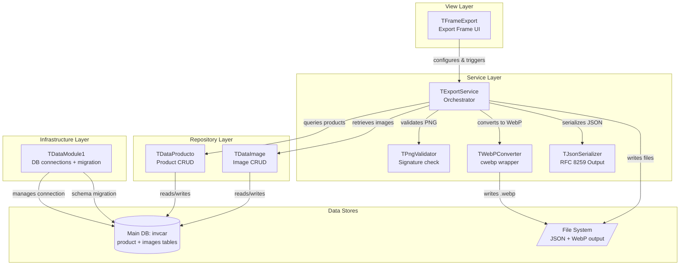
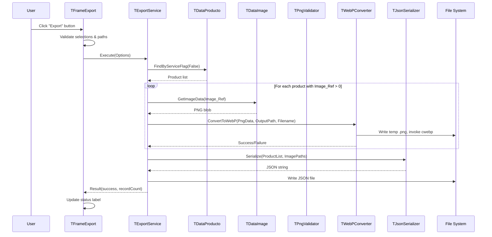
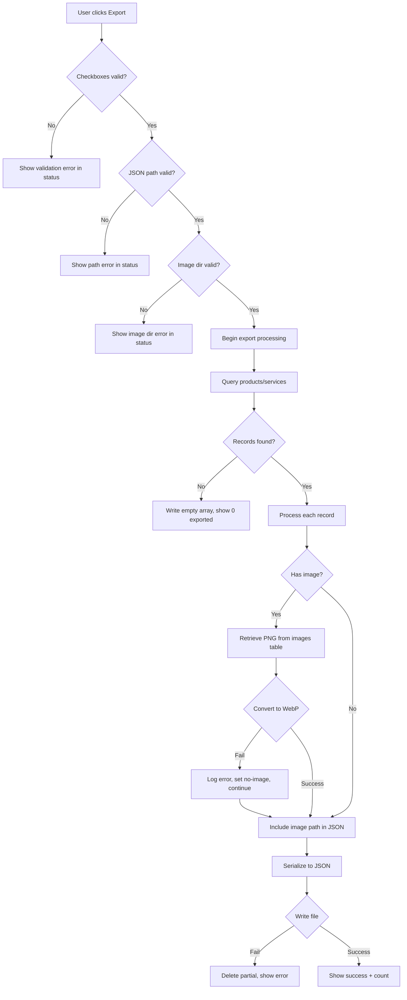

# Design Document: JSON Export

## Overview

The JSON Export feature extends the Apotheca POS system to export product and service data as structured JSON files for integration with external web catalogs. The feature encompasses:

1. **Product model extension** — Three new attributes: `Image_Ref` (integer FK to images table), `Original_Price` (real), and `Service_Flag` (boolean)
2. **Separate images table** — A dedicated `images` table in the main database storing PNG blobs, isolated from the product table
3. **PNG validation** — 8-byte signature check before accepting image uploads
4. **PNG-to-WebP conversion** — Using the `cwebp` command-line tool (from Google's libwebp) to convert images during export, with filenames derived from normalized product names
5. **Export Frame UI** — A TFrame-based sidebar panel with checkboxes, file path selectors, and an export button
6. **Export Service** — Orchestrates querying, image conversion, JSON serialization, and file writing
7. **JSON Serializer** — RFC 8259-compliant output with 2-space indentation and fixed key ordering

### Design Rationale

- **Separate images table**: Keeps image binary data isolated from the product table in a dedicated `images` table within the same main database. This avoids mixing large BLOBs with frequently queried product columns while keeping the architecture simple (single database connection).
- **External `cwebp` tool**: Free Pascal/Lazarus lacks a mature native WebP encoder. The BGRABitmap library has an experimental webp package, but using Google's `cwebp` CLI (available on all target platforms) provides stable, well-tested lossy compression with a simple `TProcess` invocation. This avoids adding heavy library dependencies.
- **Custom JSON serializer**: Free Pascal's `fpjson` unit does not guarantee key insertion order or specific indentation formatting. A custom serializer ensures RFC 8259 compliance with deterministic key ordering and 2-space indent.
- **Non-destructive migration**: ALTER TABLE ADD COLUMN is the only safe schema migration for SQLite (no column rename/drop without table rebuild). Each column is added individually with error handling to allow partial upgrades.

## Architecture



### Component Interaction Flow (Export)



## Components and Interfaces

### TProduct (Extended Model)

**Unit**: `model/uproduct.pas`

New private fields and public accessors added to the existing class:

```pascal
// New private fields
imageRef: Integer;      // FK to images.id in images table; 0 = no image
originalPrice: Real;    // Original retail price (0.00..999999999.99)
isService: Boolean;     // True = service, False = physical product

// New public methods
procedure setImageRef(newImageRef: Integer);
function getImageRef(): Integer;
procedure setOriginalPrice(newOriginalPrice: Real);
function getOriginalPrice(): Real;
procedure setIsService(newIsService: Boolean);
function getIsService(): Boolean;
```

### TDataImage (New Repository)

**Unit**: `repository/udataimage.pas`

```pascal
TDataImage = class(TData)
public
  constructor Create(Connection: TSQLite3Connection);
  function Store(productId: Integer; const PngData: TBytes): Integer;
  function Update(imageId: Integer; const PngData: TBytes): Boolean;
  function Get(imageId: Integer): TBytes;
  function GetByProduct(productId: Integer): TBytes;
  function Delete(productId: Integer): Boolean;
end;
```

Operates on the same `TSQLite3Connection` as the main database, accessing the `images` table.

### TPngValidator (New Service)

**Unit**: `service/upngvalidator.pas`

```pascal
TPngValidator = class(TObject)
public
  class function IsValidPng(const Data: TBytes): Boolean;
  class function IsValidPngFile(const FilePath: String): Boolean;
  class function GetValidationError(const Data: TBytes): String;
end;
```

Checks the 8-byte PNG signature: `$89, $50, $4E, $47, $0D, $0A, $1A, $0A`.

### TWebPConverter (New Service)

**Unit**: `service/uwebpconverter.pas`

```pascal
TWebPConverter = class(TObject)
private
  FCwebpPath: String;
  function FindCwebp(): String;
public
  constructor Create;
  function Convert(const PngData: TBytes; const OutputDir: String;
                   const NormalizedName: String; Quality: Integer = 80): Boolean;
  function GetLastError(): String;
  class function NormalizeProductName(const Name: String): String;
end;
```

- Writes PNG data to a temporary file
- Invokes `cwebp -q 80 input.png -o output.webp` via `TProcess`
- Cleans up temporary file
- Returns success/failure

### TJsonSerializer (New Service)

**Unit**: `service/ujsonserializer.pas`

```pascal
TJsonSerializer = class(TObject)
public
  function SerializeProducts(Products: TList; const ImageDir: String): String;
  function SerializeServices(Services: TList; const ImageDir: String): String;
private
  function SerializeProduct(Product: TProduct; const ImagePath: String): String;
  function SerializeService(Product: TProduct; const ImagePath: String): String;
  function EscapeJsonString(const S: String): String;
  function RoundHalfUp(Value: Real): Integer;
  function FormatJsonObject(const Pairs: array of String): String;
end;
```

- Produces RFC 8259 JSON with 2-space indentation
- Fixed key ordering per requirements
- Round-half-up for price integers
- UTF-8 encoding with proper character escaping

### TExportService (New Service)

**Unit**: `service/uexportservice.pas`

```pascal
TExportResult = record
  Success: Boolean;
  ProductCount: Integer;
  ServiceCount: Integer;
  ProductFile: String;
  ServiceFile: String;
  ErrorMessage: String;
end;

TExportOptions = record
  ExportProducts: Boolean;
  ExportServices: Boolean;
  OutputFilePath: String;
  ImageOutputDir: String;
end;

TExportService = class(TObject)
private
  FConnection: TSQLite3Connection;
  FSerializer: TJsonSerializer;
  FConverter: TWebPConverter;
  function DeriveFilePaths(const BasePath: String; Both: Boolean): TStringArray;
  function QueryProducts(IsService: Boolean): TList;
  function ProcessImage(Product: TProduct; const ImageDir: String): String;
public
  constructor Create(AConnection: TSQLite3Connection);
  destructor Destroy; override;
  function Execute(const Options: TExportOptions): TExportResult;
end;
```

### TFrameExport (New View)

**Unit**: `view/uframeexport.pas`

LCL TFrame with:
- `chkProducts: TCheckBox` — "Export Products" (checked by default)
- `chkServices: TCheckBox` — "Export Services" (checked by default)
- `edtFilePath: TEdit` — Read-only, shows JSON output path
- `btnBrowseFile: TBitBtn` — Opens TSaveDialog for `.json`
- `edtImageDir: TEdit` — Read-only, shows image output directory
- `btnBrowseDir: TBitBtn` — Opens TSelectDirectoryDialog
- `btnExport: TBitBtn` — Triggers export
- `btnSelectImage: TBitBtn` — Associates PNG image with selected product
- `lblStatus: TLabel` — Displays result/error messages

### TDataModule1 (Extended Infrastructure)

**Unit**: `infrastructure/udatamodule.pas`

New private methods:
```pascal
procedure MigrateProductExportColumns;  // Adds image_ref, originalprice, isservice
procedure CreateImagesTable;            // Creates images table if not exists
```

New public field:
```pascal
ImagesTableReady: Boolean;  // False if images table creation failed
```

## Data Models

### Product Table (Extended Schema)

```sql
CREATE TABLE IF NOT EXISTS product (
  id INTEGER PRIMARY KEY AUTOINCREMENT NOT NULL,
  name TEXT NOT NULL,
  minstock INTEGER,
  maxstock INTEGER,
  image_ref INTEGER DEFAULT 0,      -- FK to images.id in images table
  originalprice REAL DEFAULT 0.0,   -- Original retail price
  isservice INTEGER DEFAULT 0       -- 0=product, 1=service
);
```

Migration adds columns individually via ALTER TABLE if they don't exist (checked with `PRAGMA table_info(product)`).

### Images Table (in main database)

```sql
CREATE TABLE IF NOT EXISTS images (
  id INTEGER PRIMARY KEY AUTOINCREMENT,
  product_id INTEGER NOT NULL,
  data BLOB NOT NULL
);

CREATE INDEX IF NOT EXISTS idx_images_product ON images(product_id);
```

### Exported JSON Schema — Products

```json
[
  {
    "id": "p42",
    "name": "Acetaminophen 500mg",
    "price": 150,
    "originalPrice": 180,
    "description": "",
    "images": ["/acetaminophen_500mg.webp"],
    "isVisible": true
  }
]
```

### Exported JSON Schema — Services

```json
[
  {
    "id": "s12",
    "name": "Blood Pressure Check",
    "price": 50,
    "originalPrice": 60,
    "description": "",
    "image": "/blood_pressure_check.webp"
  }
]
```

### Name Normalization Rules

Input: Product name (arbitrary Unicode string)
Output: Lowercase, spaces and non-alphanumeric characters replaced by `_`

```
"Acetaminophen 500mg"  → "acetaminophen_500mg"
"Ibuprofeno (400 mg)"  → "ibuprofeno__400_mg_"
"Vitamina C+D"         → "vitamina_c_d"
```

Algorithm:
1. Convert to lowercase
2. For each character: if it is a letter (a-z) or digit (0-9), keep it; otherwise replace with `_`


## Correctness Properties

*A property is a characteristic or behavior that should hold true across all valid executions of a system — essentially, a formal statement about what the system should do. Properties serve as the bridge between human-readable specifications and machine-verifiable correctness guarantees.*

### Property 1: PNG Signature Validation

*For any* byte array of arbitrary length and content, `TPngValidator.IsValidPng` SHALL return True if and only if the array has at least 8 bytes and the first 8 bytes are exactly `[$89, $50, $4E, $47, $0D, $0A, $1A, $0A]`; otherwise it SHALL return False.

**Validates: Requirements 3.1, 3.2, 3.3**

### Property 2: Original Price Range Validation and Round-Trip

*For any* TProduct instance with an existing Original_Price value P, and *for any* real number V: if V is in the range [0.00, 999999999.99] then calling `setOriginalPrice(V)` followed by `getOriginalPrice()` SHALL return V; if V < 0.00 then calling `setOriginalPrice(V)` followed by `getOriginalPrice()` SHALL return the previous value P unchanged.

**Validates: Requirements 4.2, 4.3**

### Property 3: Name Normalization Output Invariant

*For any* non-empty string S, `TWebPConverter.NormalizeProductName(S)` SHALL produce a string where every character is either a lowercase ASCII letter (a-z), a digit (0-9), or an underscore (_), and the result is equivalent to lowercasing S and replacing every non-alphanumeric character with underscore.

**Validates: Requirements 8.3, 8.4**

### Property 4: Product JSON Serialization Structure

*For any* TProduct with Service_Flag = False, valid Name, Balance (with stock and price), Original_Price, and an image path string (possibly empty), the serialized JSON object SHALL:
- Contain exactly the keys `"id"`, `"name"`, `"price"`, `"originalPrice"`, `"description"`, `"images"`, `"isVisible"` in that fixed order
- Have `"id"` equal to `"p"` concatenated with the integer ID as a string
- Have `"price"` as an integer equal to `RoundHalfUp(balance.price)`
- Have `"originalPrice"` as an integer equal to `RoundHalfUp(originalPrice)`
- Have `"images"` as an array containing the image path if non-empty, or an empty array
- Have `"isVisible"` equal to `true` if balance.stock > 0, `false` otherwise

**Validates: Requirements 9.2, 9.3, 11.6**

### Property 5: Service JSON Serialization Structure

*For any* TProduct with Service_Flag = True, valid Name, Balance (with price), Original_Price, and an image path string (possibly empty), the serialized JSON object SHALL:
- Contain exactly the keys `"id"`, `"name"`, `"price"`, `"originalPrice"`, `"description"`, `"image"` in that fixed order
- Have `"id"` equal to `"s"` concatenated with the integer ID as a string
- Have `"price"` as an integer equal to `RoundHalfUp(balance.price)`
- Have `"originalPrice"` as an integer equal to `RoundHalfUp(originalPrice)`
- Have `"image"` as a string containing the image path, or empty string if no image

**Validates: Requirements 10.2, 10.3, 11.6**

### Property 6: File Path Derivation

*For any* base file path string P: if P contains the substring `".json"`, then `DeriveFilePaths(P, True)` SHALL produce two paths where `"_products"` is inserted immediately before `".json"` in one and `"_services"` immediately before `".json"` in the other; if P does not contain `".json"`, then the two paths SHALL be `P + "_products.json"` and `P + "_services.json"`.

**Validates: Requirements 9.5, 10.4**

### Property 7: JSON String Escaping

*For any* string S containing arbitrary Unicode characters, `EscapeJsonString(S)` SHALL:
- Replace every `"` with `\"`
- Replace every `\` with `\\`
- Replace every control character (U+0000 through U+001F) with its `\uXXXX` escape sequence
- Leave all other characters unchanged
- Produce output that, when placed between double quotes, forms a valid JSON string value per RFC 8259

**Validates: Requirements 11.3**

### Property 8: Round-Half-Up Pricing

*For any* real number V in the range [0.0, 999999999.99], `RoundHalfUp(V)` SHALL return the integer equal to `Floor(V + 0.5)`.

**Validates: Requirements 11.4**

### Property 9: JSON Serialization Idempotence

*For any* list of TProduct records (products or services), if the JSON output produced by `TJsonSerializer` is parsed by a conforming JSON parser and the resulting data structure is re-serialized using the same `TJsonSerializer` with the same settings, the output SHALL be byte-for-byte identical to the original serialization.

**Validates: Requirements 11.7**

## Error Handling

### Error Categories and Response Strategy

| Error | Detection Point | Response | User Feedback |
|-------|----------------|----------|---------------|
| No export option selected | TFrameExport (pre-export) | Block export, no I/O | Status label: validation message |
| Invalid JSON output path | TExportService.Execute | Block export | Status label: "Target directory is invalid" |
| Invalid image output directory | TExportService.Execute | Block export | Status label: "Image output directory is invalid or not writable" |
| PNG validation failure | TPngValidator | Reject image upload | Dialog: "Only PNG format images are accepted" |
| Empty image file | TPngValidator | Reject image upload | Dialog: "The file is empty" |
| cwebp not found | TWebPConverter.FindCwebp | Disable conversion | Log warning; treat all products as no-image |
| WebP conversion failure | TWebPConverter.Convert | Skip image for this product | Log error with product ID; continue export |
| File write permission error | TExportService (file write) | Delete partial file | Status label: "File could not be saved" |
| images table creation failure | TDataModule1.CreateImagesTable | Disable image features | Log error; ImagesTableReady := False |
| ALTER TABLE failure | TDataModule1.MigrateProductExportColumns | Skip column, continue | Log error with column name |
| No matching records | TExportService.Execute | Write empty JSON array `[]` | Status label: "0 records exported" |
| Partial export failure (dual) | TExportService.Execute | Retain successful file | Status label: which file failed/succeeded |

### Error Flow Diagram



## Testing Strategy

### Unit Tests (Example-Based)

Unit tests cover specific scenarios, edge cases, and UI initialization:

- **Model initialization**: Verify default values (imageRef=0, originalPrice=0.0, isService=False)
- **PNG validator edge cases**: Empty file, 7-byte file, valid PNG header
- **Export Frame defaults**: Checkboxes checked, paths initialized, status empty
- **File path derivation examples**: Known inputs produce expected output paths
- **Round-half-up boundary**: 0.5 → 1, 1.4 → 1, 1.5 → 2, 0.0 → 0

### Property-Based Tests (FPCUnit + Random Harness)

Property-based tests validate universal correctness properties using the FPCUnit framework with a random generator harness (minimum 150 iterations per property), following the same pattern established in `tests/test_csv_export.pas`.

**Library**: FPCUnit with custom random data generators (the project's existing pattern)

**Configuration**:
- Minimum 150 iterations per property test
- Each test tagged with: `Feature: json-export, Property {N}: {title}`

**Test files**:
- `tests/test_png_validator.pas` — Property 1
- `tests/test_original_price.pas` — Property 2
- `tests/test_name_normalization.pas` — Property 3
- `tests/test_json_serializer.pas` — Properties 4, 5, 6, 7, 8, 9

### Integration Tests

Integration tests verify cross-component behavior with real SQLite databases:

- **Images table CRUD**: Store, retrieve, update, delete image records in the images table
- **Product persistence round-trip**: Save and reload products with new attributes
- **WebP conversion**: Valid PNG produces .webp file on disk (requires cwebp installed)
- **Full export pipeline**: Products + services exported to correct files with correct content
- **Migration idempotency**: Run migration twice without errors

### Smoke Tests

- Application starts with fresh database (no existing columns)
- Application starts with existing columns (no-op migration)
- Images table created on first run
- Export button visible and navigable in sidebar
