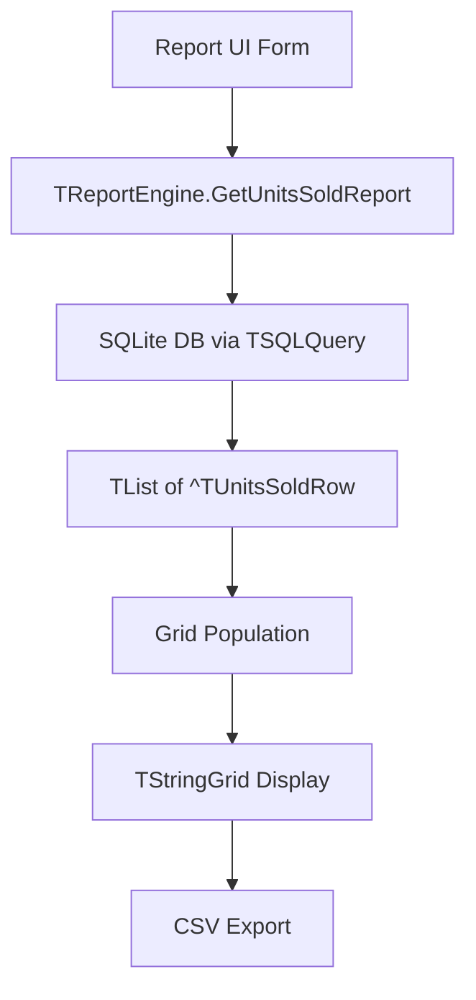

# Design Document: Units Sold Report

## Overview

The Units Sold Report extends the existing `TReportEngine` with a new method that aggregates sale transactions by product within a date range. It returns per-product rows showing total units sold, revenue, cost, and utility (profit), ordered by units sold descending. The feature includes grid display via `TStringGrid` with formatted columns and a grand totals row, plus CSV export capability using the established export pattern.

The design follows the existing layered architecture:
- **Model layer**: New `TUnitsSoldRow` record for report row data
- **Service layer**: New `GetUnitsSoldReport` method on `TReportEngine`
- **Infrastructure layer**: Grid population helper using `UGridUtils`
- **Export**: CSV export following the existing `ExportGridToCSV` pattern

## Architecture



### Data Flow

1. The UI form provides `StartDate` and `EndDate` parameters
2. `TReportEngine.GetUnitsSoldReport` builds and executes an aggregation SQL query
3. Results are returned as a `TList` of `^TUnitsSoldRow` pointers, plus grand total out-parameters
4. The UI form populates a `TStringGrid` using the returned list
5. CSV export iterates the grid cells using the established quoted-field pattern

### Design Decisions

| Decision | Rationale |
|----------|-----------|
| Single SQL query with GROUP BY | Aggregation at the DB level is efficient; avoids loading all items into memory and iterating in Pascal |
| Record type with heap allocation | Consistent with existing patterns (`TIncomeUtilityReportRow`, `TPurchaseReportRow`) using `New(RowPtr)` / `TList` |
| Julian Day date conversion | Existing codebase stores dates as Julian Day numbers in SQLite; must maintain same conversion formula |
| Descending units sold with name tiebreaker | Per requirement 1.6; implemented directly in SQL ORDER BY clause |
| Grand totals as out-parameters | Consistent with `GetInventoryValuationReport` pattern; avoids extra iteration |

## Components and Interfaces

### TUnitsSoldRow (Record)

New record type declared in `service/ureportengine.pas`:

```pascal
TUnitsSoldRow = record
  ProductId   : Integer;
  ProductName : String;
  UnitsSold   : Integer;
  TotalRevenue: Real;
  TotalCost   : Real;
  Utility     : Real;
end;
```

### TReportEngine.GetUnitsSoldReport (Method)

```pascal
function GetUnitsSoldReport(
  StartDate, EndDate: TDateTime;
  var GrandTotalUnits: Integer;
  var GrandTotalRevenue, GrandTotalCost, GrandTotalUtility: Real
): TList;
```

**Parameters:**
- `StartDate`, `EndDate`: Inclusive date range filter. If `StartDate > EndDate`, returns empty list with zeroed totals.
- `GrandTotalUnits` (out): Sum of all `UnitsSold` across product rows.
- `GrandTotalRevenue` (out): Sum of all `TotalRevenue` rounded to 2 decimal places.
- `GrandTotalCost` (out): Sum of all `TotalCost` rounded to 2 decimal places.
- `GrandTotalUtility` (out): Sum of all `Utility` across product rows.

**Returns:** `TList` of `^TUnitsSoldRow` pointers. Caller is responsible for disposing.

**Behavior:**
- If `FConnection = nil`, returns empty list with zeroed totals (no exception).
- If query fails, returns empty list with zeroed totals (exception caught internally).
- Results are ordered by `UnitsSold DESC, ProductName ASC`.

### Grid Population

The report form will populate a `TStringGrid` with 5 columns:

| Column Index | Header | Content |
|---|---|---|
| 0 | Producto | Product name |
| 1 | Unidades Vendidas | Integer units sold |
| 2 | Ingresos | Revenue formatted `%.2f` |
| 3 | Costo | Cost formatted `%.2f` |
| 4 | Utilidad | Utility formatted `%.2f` |

The last row displays grand totals with column 0 showing "TOTAL".

Column widths are distributed using `DistributeColumns(Grid, [30, 18, 18, 18, 16])`.

### CSV Export

Follows the existing pattern from `TFrameReports.BtnExportCSVClick`:

```pascal
procedure ExportUnitsSoldToCSV(Grid: TStringGrid; const FileName: String);
```

- Header row: `"Product","Units Sold","Revenue","Cost","Utility"`
- Data rows: quoted comma-separated values matching grid cells
- Last row: grand totals with "Total" label
- On write failure: shows error message, preserves grid data

## Data Models

### Database Schema (Existing Tables Used)

```sql
-- operation: stores transactions (sales, purchases)
CREATE TABLE operation (
  id INTEGER PRIMARY KEY,
  type INTEGER,       -- FK to operationtype.id
  date REAL,          -- Julian Day Number
  person INTEGER,     -- FK to person.id
  credit INTEGER
);

-- operationtype: classifies operations
CREATE TABLE operationtype (
  id INTEGER PRIMARY KEY,
  type TEXT           -- 'in' for purchases, 'out' for sales
);

-- item: line items within an operation
CREATE TABLE item (
  id INTEGER PRIMARY KEY,
  operation INTEGER,  -- FK to operation.id
  product INTEGER,    -- FK to product.id
  cost REAL,          -- unit cost at time of sale
  stock INTEGER,      -- quantity sold (confusingly named "stock")
  price REAL          -- unit price at time of sale
);

-- product: product catalog
CREATE TABLE product (
  id INTEGER PRIMARY KEY,
  name TEXT,
  minstock INTEGER,
  maxstock INTEGER
);
```

### Aggregation SQL Query

```sql
SELECT pr.id AS product_id, pr.name AS product_name,
       SUM(i.stock) AS units_sold,
       ROUND(SUM(i.stock * i.price), 2) AS total_revenue,
       ROUND(SUM(i.stock * i.cost), 2) AS total_cost
FROM operation o
JOIN operationtype ot ON o.type = ot.id
JOIN item i ON i.operation = o.id
JOIN product pr ON i.product = pr.id
WHERE ot.type = 'out'
  AND o.date >= :start_date
  AND o.date <= :end_date
GROUP BY pr.id, pr.name
HAVING SUM(i.stock) > 0
ORDER BY units_sold DESC, pr.name ASC
```

Date parameters are converted to Julian Day using the existing formula:
- `start_date := Int(StartDate) + 2415018.5`
- `end_date := Int(EndDate) + 2415019.49999` (covers full end-of-day)

### TUnitsSoldRow Lifecycle

1. Allocated with `New(RowPtr)` during query iteration
2. Added to `TList` result
3. Caller iterates list for grid population
4. Caller disposes each pointer with `Dispose()` and frees the `TList`

## Correctness Properties

*A property is a characteristic or behavior that should hold true across all valid executions of a system — essentially, a formal statement about what the system should do. Properties serve as the bridge between human-readable specifications and machine-verifiable correctness guarantees.*

### Property 1: Aggregation correctness

*For any* set of sale items with known product IDs, quantities, unit prices, and unit costs, grouping by product and computing aggregates SHALL produce exactly one row per distinct product, where each row's `UnitsSold` equals the sum of quantities for that product, `TotalRevenue` equals the sum of (quantity × unit price) rounded to 2 decimal places, and `TotalCost` equals the sum of (quantity × unit cost) rounded to 2 decimal places.

**Validates: Requirements 1.2, 1.3, 1.4, 6.5**

### Property 2: Utility invariant

*For any* `TUnitsSoldRow`, the `Utility` field SHALL equal `TotalRevenue - TotalCost`, rounded to 2 decimal places.

**Validates: Requirements 1.5, 6.4**

### Property 3: Grand totals invariant

*For any* non-empty result list from `GetUnitsSoldReport`, `GrandTotalUnits` SHALL equal the sum of `UnitsSold` across all rows, `GrandTotalRevenue` SHALL equal the sum of `TotalRevenue` across all rows, `GrandTotalCost` SHALL equal the sum of `TotalCost` across all rows, and `GrandTotalUtility` SHALL equal the sum of `Utility` across all rows.

**Validates: Requirements 1.7, 6.1, 6.2, 6.3, 6.6**

### Property 4: Sort order

*For any* result list from `GetUnitsSoldReport` with more than one row, every consecutive pair of rows (i, i+1) SHALL satisfy: `UnitsSold[i] >= UnitsSold[i+1]`, and when `UnitsSold[i] = UnitsSold[i+1]` then `ProductName[i] <= ProductName[i+1]` (lexicographic ascending).

**Validates: Requirements 1.6**

### Property 5: Date filter correctness

*For any* set of transactions with random dates and any valid date range [StartDate, EndDate] where StartDate <= EndDate, all rows in the result SHALL correspond to items from transactions with dates within the inclusive range, and no transaction with a date within the range SHALL be excluded from aggregation.

**Validates: Requirements 2.1, 2.2**

### Property 6: CSV export round-trip

*For any* valid Units Sold Report data populated in a grid (header row + N data rows + totals row), exporting to CSV and then parsing the CSV back SHALL produce field values identical to the original grid cell values, with the correct number of lines (N+2) and correct number of fields per line (5).

**Validates: Requirements 5.2, 5.6**

## Error Handling

| Scenario | Behavior |
|----------|----------|
| `FConnection = nil` | Return empty TList, set all grand totals to 0, no exception raised |
| SQL query exception | Catch exception, rollback transaction, return empty TList with zeroed totals |
| `StartDate > EndDate` | Return empty TList with zeroed totals immediately (no query executed) |
| CSV file write failure | Show error message to user, preserve grid data unchanged |
| Empty result set | Return valid empty TList (Count = 0), all totals = 0 |

Error handling follows the existing `TReportEngine` pattern:
- Wrap query execution in `try..except`
- Rollback `TSQLTransaction` on failure
- Return safe default values (empty list + zero totals)
- Never propagate unhandled exceptions to the UI layer

## Testing Strategy

### Property-Based Tests (FPCUnit with random harness, 150 iterations each)

The project uses FPCUnit with a manual random-generation loop pattern (no external PBT library). Each test generates random inputs for 150 iterations and asserts the property holds on each iteration.

**Library**: FPCUnit (existing) with manual iteration loop
**Configuration**: 150 iterations per property test (consistent with existing tests)
**Tag format**: `Feature: units-sold-report, Property N: <title>`

| Property | Test Unit | What Varies |
|----------|-----------|-------------|
| 1: Aggregation correctness | `test_units_sold_aggregation.pas` | Number of products (1..20), items per product (1..10), random quantities (1..100), prices (0.01..999.99), costs (0.01..499.99) |
| 2: Utility invariant | `test_units_sold_aggregation.pas` | Random revenue and cost values |
| 3: Grand totals invariant | `test_units_sold_aggregation.pas` | Random rows with varying metrics |
| 4: Sort order | `test_units_sold_aggregation.pas` | Random product names, random unit counts including ties |
| 5: Date filter | `test_units_sold_date_filter.pas` | Random dates within last year, random date ranges |
| 6: CSV round-trip | `test_units_sold_csv.pas` | Random product names, random numeric values, varying row counts (0..25) |

### Example-Based Tests

| Requirement | Test Case |
|---|---|
| 3.2 | Nil connection returns empty list, no exception |
| 3.3 | Induced query error returns empty list gracefully |
| 4.1 | Grid column headers are in correct order |
| 5.1 | CSV header row contains expected column names |
| 5.3 | Last CSV row has "Total" label with correct values |
| 5.5 | Write to invalid path shows error, grid unchanged |

### Edge Case Tests

| Requirement | Edge Case |
|---|---|
| 1.8 / 2.4 | Start date after end date → empty result |
| 2.3 | Start = End (single day) includes all transactions on that day |
| 3.1 | No transactions in range → empty list, zero totals |
| 4.5 | Empty result list → grid shows headers + zero totals row only |
| 5.4 | Empty report CSV → header + zero totals row only |

### Test Runners

Each property-based test gets its own `.lpr` runner (consistent with existing pattern):
- `tests/run_units_sold_aggregation_test.lpr`
- `tests/run_units_sold_date_filter_test.lpr`
- `tests/run_units_sold_csv_test.lpr`

