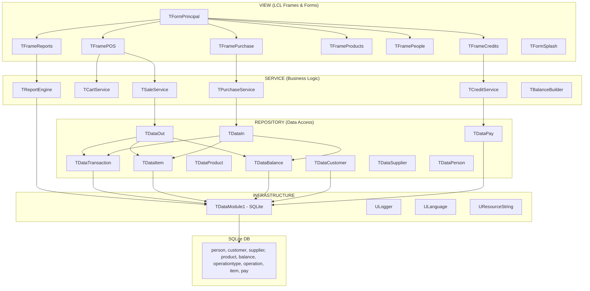
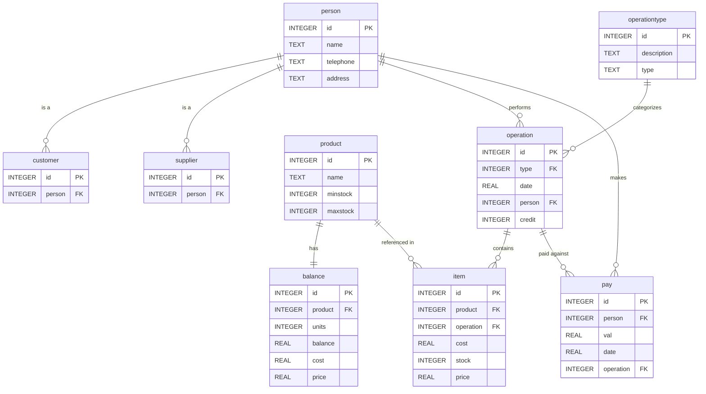
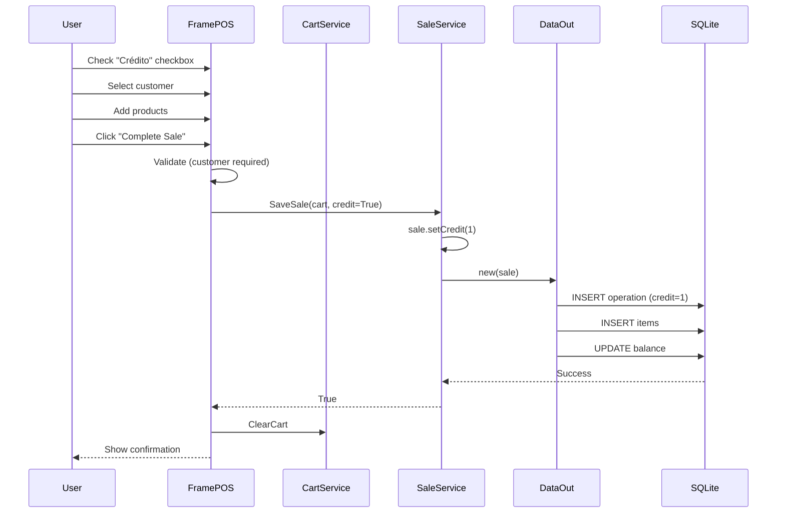
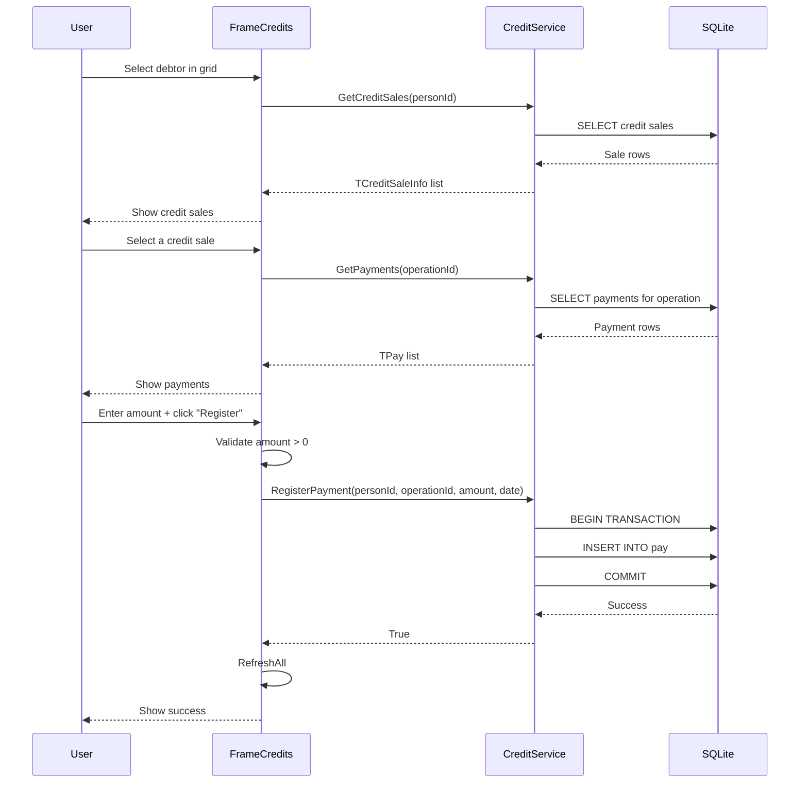
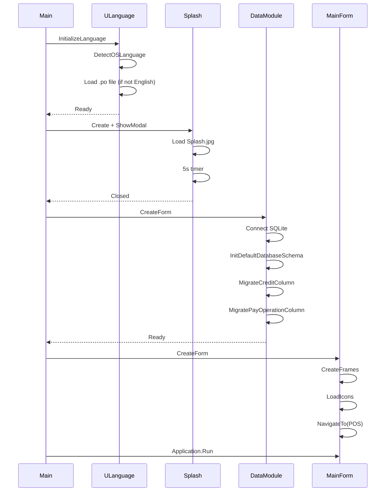
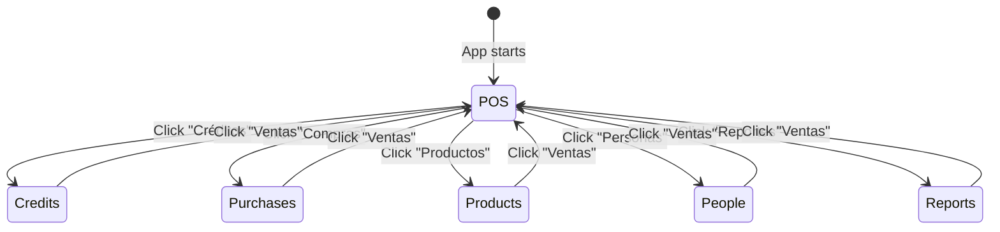

# Apothêca

Inventory and point-of-sale management application for billiard supplies. Built with Free Pascal and Lazarus LCL.

## Features

- Point of Sale (POS) with product search, cart, and customer selection
- Purchase management with supplier tracking
- Credit sales and debt payment management
- Product inventory with balance tracking
- Customer and supplier management
- Reports (income, inventory valuation, purchases)
- Multi-language support (English default, Spanish via OS detection)
- OWASP-compliant structured logging

## Architecture

### Project Structure

```
invcar/
├── apotheca.lpr            # Main program entry point
├── apotheca.lpi            # Lazarus project file
├── db/                     # Database
│   ├── invcar              # SQLite database file
│   └── schema.sql          # DDL script
├── icons/                  # UI icons (SVG sources + PNG exports)
├── infrastructure/         # Cross-cutting concerns
│   ├── udatamodule.pas     # Database connection and migrations
│   ├── ugridutils.pas      # TStringGrid helpers
│   ├── ulanguage.pas       # i18n / OS language detection
│   ├── ulogger.pas         # OWASP-compliant structured logger
│   └── uresourcestring.pas # All UI strings (English default)
├── languages/              # Translation files
│   └── es/apotheca.es.po   # Spanish translations
├── model/                  # Domain models
│   ├── utransaction.pas    # Base transaction (purchase/sale)
│   ├── upurchase.pas       # Purchase (extends TIn)
│   ├── usale.pas           # Sale (extends TOut)
│   ├── uitem.pas           # Line item within a transaction
│   ├── uproduct.pas        # Product catalog entry
│   ├── ubalance.pas        # Product stock/valuation
│   ├── uperson.pas         # Person (name, phone, address)
│   ├── ucustomer.pas       # Customer (extends Person)
│   ├── usupplier.pas       # Supplier (extends Person)
│   ├── upay.pas            # Payment record
│   ├── udebtorinfo.pas     # Debtor summary (credit view)
│   └── ucreditsaleinfo.pas # Credit sale detail
├── repository/             # Data access layer
│   ├── udata.pas           # Base repository class
│   ├── udatatransaction.pas# Transaction persistence
│   ├── udatain.pas         # Purchase persistence
│   ├── udataout.pas        # Sale persistence
│   ├── udataitem.pas       # Item persistence
│   ├── udataproduct.pas    # Product queries
│   ├── udatabalance.pas    # Balance read/write
│   ├── udatacustomer.pas   # Customer queries
│   ├── udatasupplier.pas   # Supplier queries
│   ├── udataperson.pas     # Person persistence
│   └── udatapay.pas        # Payment persistence
├── service/                # Business logic layer
│   ├── usaleservice.pas    # Sale workflow (POS → persist)
│   ├── ucartservice.pas    # Shopping cart management
│   ├── ucreditservice.pas  # Credit/debt calculations
│   ├── upurchaseservice.pas# Purchase workflow
│   ├── ureportengine.pas   # Report generation
│   ├── ubalancebuilder.pas # Balance recalculation
│   └── u*validator.pas     # Input validation
├── view/                   # UI layer (LCL Frames and Forms)
│   ├── apothecamain.pas    # Main form + sidebar navigation
│   ├── uframepos.pas       # POS frame
│   ├── uframecredits.pas   # Credit management frame
│   ├── uframepurchase.pas  # Purchase entry frame
│   ├── uframeproducts.pas  # Product catalog frame
│   ├── uframepeople.pas    # Customer/supplier frame
│   ├── uframereports.pas   # Reports frame
│   ├── uformsplash.pas     # Startup splash screen
│   └── uf*.pas             # Dialog forms (find, edit)
├── tests/                  # Property-based tests (FPCUnit)
│   ├── test_balance_invariant.pas
│   ├── test_cart_arithmetic.pas
│   ├── test_product_search.pas
│   └── ...
└── res/                    # Runtime resources
    └── Splash.jpg          # Splash screen image
```

### Layer Diagram



### Components

| Component | Responsibility |
|-----------|---------------|
| `TFormPrincipal` | Main window, sidebar navigation, frame switching |
| `TFramePOS` | Product search, cart grid, credit checkbox, sale completion |
| `TFrameCredits` | Debtor list, credit sale detail, payment registration |
| `TFramePurchase` | Supplier selection, item grid, purchase save |
| `TFrameProducts` | Product CRUD with search |
| `TFramePeople` | Customer/supplier management (tabbed) |
| `TFrameReports` | Date-filtered reports with CSV export |
| `TSaleService` | Validates cart, sets credit flag, persists sale via TDataOut |
| `TCreditService` | Debt balance calculation, payment registration |
| `TCartService` | In-memory cart operations (add, remove, quantities) |
| `TDataModule1` | DB connection, schema creation, migrations |
| `ULogger` | OWASP-compliant file logging with rotation |
| `ULanguage` | OS language detection, .po file loading |

### Data Model



## Sequence Diagrams

### Credit Sale (POS)



### Payment Registration



### Application Startup



### Navigation Flow



## Prerequisites

- **Free Pascal Compiler** (FPC) 3.2.2+
- **Lazarus IDE** 2.2+ (provides `lazbuild` CLI)
- **SQLite3** runtime library

### Linux (Debian/Ubuntu)

```bash
sudo apt install fpc lazarus libsqlite3-0
```

### Linux (Arch)

```bash
sudo pacman -S fpc lazarus sqlite
```

## Building

### Using Makefile

```bash
make build     # Compile the application
make test      # Run all property-based tests
make run       # Build and run
make clean     # Remove build artifacts
make package   # Create distributable archive
```

### Using lazbuild directly

```bash
lazbuild apotheca.lpi
```

## Running

```bash
./apotheca
```

The application will:
1. Show a splash screen for 5 seconds
2. Create/connect to `db/invcar` SQLite database
3. Run schema migrations automatically
4. Detect OS language and load translations
5. Display the main window with sidebar navigation

## Testing

Tests use FPCUnit with property-based testing (100+ random iterations per property):

```bash
make test
```

Individual test suites:

```bash
cd tests
./run_balance_invariant_test
./run_sale_balance_test
./run_product_search_test
```

## Logging

Logs are written to `logs/apotheca.log` with automatic rotation (5 MB max, 5 files kept).

Format: `TIMESTAMP | LEVEL | SOURCE | EVENT | DETAILS`

Levels: DEBUG, INFO, WARN, ERROR, SECURITY

## License

GNU General Public License v2.0 or later. See source file headers.
